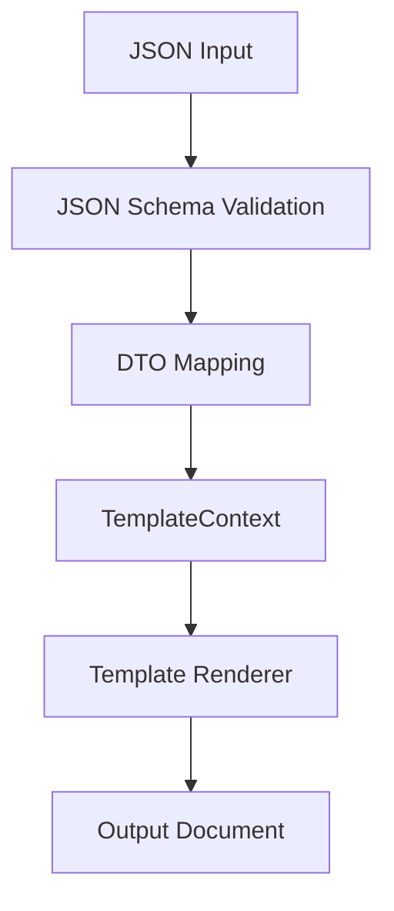

# Contract Generator Architecture

## Project Structure

```text
contract-generator/
├── src/
│   ├── main/
│   │   ├── java/com/example/contractgenerator/
│   │   │   ├── config/        # Application configuration
│   │   │   ├── cli/           
│   │   │   ├── service/       # Business logic
│   │   │   ├── repository/    # File/storage handling
│   │   │   ├── model/         # DTOs and domain models
│   │   │   ├── validator/     # JSON validators by schema
│   │   │   ├── template/      # Document templates and rendering
│   │   │   ├── security/      # Injection protection (escaping)
│   │   │   └── exception/     # Custom exceptions
│   │   └── resources/
│   │       ├── templates/     # Template files (.ftl, .txt, etc.)
│   │       ├── schemas/       # JSON Schema for validation
│   │       └── application.yml # Configuration file
│   └── test/
│       └── java/com/example/contractgenerator/ # Unit and integration tests
└── pom.xml (or build.gradle)
```



## Core Components

### 1. Data Models (`model`)
- `CompanyDTO` — company model
- `ContractDTO` — contract model
- `TemplateContext` — combined structure for template substitution

### 2. Validation (`validator`)
- JSON Schema validation using `company-schema.json` and `contract-schema.json`
- Checking fields presence, data types, value ranges
- Additional validation

### 3. Security (`security`)
- Data escaping via OWASP Java Encoder
- Immutable DTOs after validation
- Optional SHA-256 hash for data integrity control

### 4. Generation Service (`service`)
- `ContractService` — main process orchestrator
- `TemplateRenderer` — interface with implementations for specific formats:
  - `TextTemplateRenderer` — plain text
  - `PdfTemplateRenderer` — PDF (Apache PDFBox / iText)
  - `HtmlTemplateRenderer` — HTML (Thymeleaf / FreeMarker)

### 5. Templates (`template`)
- Templates stored in `resources/templates/`

### 6. Repository (`repository`)
- `FileRepository` — I/O abstraction
- Implementation via Java NIO (`Files.readString()`, `Files.write()`)

### 7. Configuration (`config`)
- `AppConfig` — bean with application settings
- Paths to templates, security rules, default output format

### 8. Exception Handling (`exception`)
- `ValidationException` — JSON validation errors
- `SecurityException` — injection attempts
- `TemplateRenderException` — template rendering errors

## Data Flow

1. **Input**: three JSON files (customer, contractor, contract)
2. **Validation**: check against JSON schemas
3. **Mapping**: transformation to DTOs (`CompanyDTO`, `ContractDTO`)
4. **Merge**: creation of `TemplateContext`
5. **Escaping**: data cleaning before substitution
6. **Rendering**: data substitution into template via `TemplateRenderer`
7. **Output**: saving result to `.txt`, `.pdf`, `.html`, etc.

## Getting Started

### Prerequisites
- Java 21
- Maven 3.8+
- Any modern IDE (IntelliJ IDEA, Eclipse, VS Code)

### Setup
1. Clone the repository:
   ```bash
   git clone <repository-url>
   ```
2. Navigate to the project directory:
   ```bash
   cd contract-generator
   ```
3. Build the project:
   ```bash
   mvn clean compile
   ```
4. Run tests:
   ```bash
   mvn test
   ```
5. Run the application (if Spring Boot is used):
   ```bash
   mvn spring-boot:run
   ```

## Usage Example

To generate a contract:

1. Prepare three JSON files with customer company, contractor company, and contract data.
2. Place them in the `input/` directory (or specify paths in command line arguments).
3. Execute the command:

   ```bash
   java -jar target/contract-generator.jar \
     --customer=input/customer.json \
     --contractor=input/contractor.json \
     --contract=input/contract.json \
     --template=templates/contract.ftl \
     --output=result.pdf
   ```

The finished document will appear in the specified output file.

## Testing

The project is covered by unit and integration tests:

- JSON validation tests
- Security tests (injections)
- Template rendering tests
- Service layer business logic tests

Run all tests:

```bash
mvn test
```

## Extending the Project

To add a new output format:

1. Create a class implementing the `TemplateRenderer` interface.
2. Implement the `render()` method for your format.
3. Register the new renderer in `ContractService` (e.g., via factory or configuration).
4. Add the corresponding template to `resources/templates/`.

## Architecture Benefits

- **Extensibility** — easy to add a new output format.
- **Security** — validation + escaping + immutable DTOs.
- **Testability** — clear separation of responsibilities.
- **Modernity** — Java 21, functional interfaces, records.
- **Transparency** — structure clear for interviews (SOLID, DI, layers).

## License

This project is licensed under the MIT License.